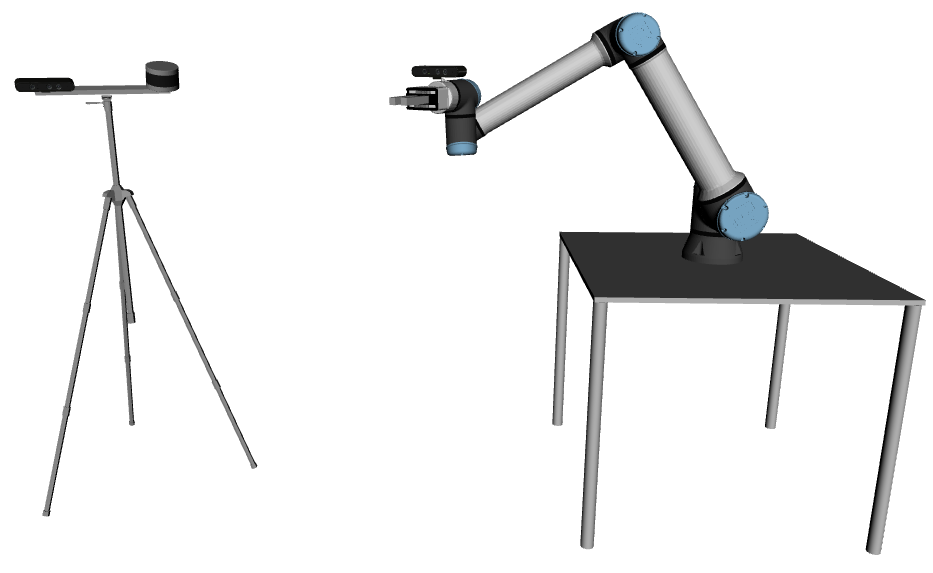
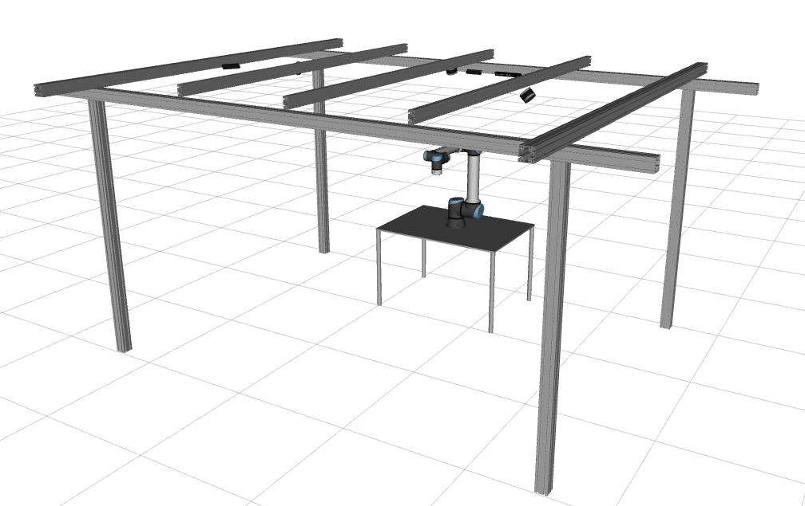

## Calibration Examples

ATOM provides extensive visualization possibilities while running the calibration optimization procedure. To visualize in ROS Rviz use the -rv flag.

<!--  -->

So far, we have used **ATOM** to successfully calibrate several robotic platforms. Here are some examples:

### MMTBot
 [MMTBot](https://github.com/miguelriemoliveira/mmtbot) is a simulated robotic system containing a manipulator, two rgb cameras and one 3D lidar, with the goal of reserching how ATOM can calibration hand-eye systems.

<figure markdown align=center>
  {width="100%" }
  <figcaption align=center>A 3D Model of the MMTBot.</figcaption>
</figure>

### Atlascar2
 
 The [Atlascar2](https://github.com/lardemua/atlascar2) is an intelligent vehicle containing several cameras and 2D Lidars. This was the first platform we have calibrated using ATOM. The repositories containing the atlascar packages are here:

<a href="https://github.com/lardemua/atlascar2">https://github.com/lardemua/atlascar2</a>

<figure markdown align=center>
  {width="80%" }
  <figcaption align=center>A photograph of the AtlasCar2.</figcaption>
</figure>

<figure markdown align=center>
  {width="80%" }
  <figcaption align=center>A 3D model of the AtlasCar2.</figcaption>
</figure>

Further details on this system can be read in the [papers published in ROBOT 2019 and RAS 2020](publications.md).

### IrisUA - ur10e 
The [IrisUA - ur10e](https://github.com/iris-ua/iris_ur10e_calibration) includes several variants of the hand-eye calibration problem. The repositories containing the calibration ros package for this system are here: 

<a href="https://github.com/iris-ua/iris_ur10e_calibration">https://github.com/iris-ua/iris_ur10e_calibration</a>

<figure markdown align=center>
  {width="60%" }
  <figcaption align=center>A photograph of the IRIS UA UR10e.</figcaption>
</figure>

<figure markdown align=center>
  {width="60%" }
  <figcaption align=center>A 3D Model of the IRIS UA UR10e.</figcaption>
</figure>

Further details on this system can be read in the [paper published in T-Ro 2021](publications.md).

### AgrobV2 
 [AgrobV2](https://github.com/aaguiar96/agrob) is a mobile robot with a stereo camera and a 3D Lidar designed for agriculture robotics.

<figure markdown align=center>
  {width="40%" }
  <figcaption align=center>A photograph of the AgrobV2.</figcaption>
</figure>

<figure markdown align=center>
  {width="45%" }
  <figcaption align=center>A 3D Model of the AgrobV2.</figcaption>
</figure>

Further details on this system can be read in the [paper published in ESWA 2021](publications.md).

### LARCC

**L**aboratory of **A**utomation and **R**obotics **C**ollaborative **C**ell (LARCC) is included in a research project focusing of collaborative robotic industrial cells. The goal is to monitor in detail the volume of the cell in order to ensure safe collaboration between human operators and robots. For this, several sensors of different modalities are positioned everywhere in the cell, which makes the calibration of this robotic system a challenging task.

<figure markdown align=center>
  {width="100%" }
  <figcaption align=center>A photograph of LARCC.</figcaption>
</figure>

<figure markdown align=center>
  {width="100%" }
  <figcaption align=center>A 3D Model of the LARCC..</figcaption>
</figure>

<figure markdown align=center>
  {width="100%" }
  <figcaption align=center>Sensor fields of view in LARCC.</figcaption>
</figure>

<figure markdown align=center>
  {width="100%" }
  <figcaption align=center>Calibration of LARCC.</figcaption>
</figure>

