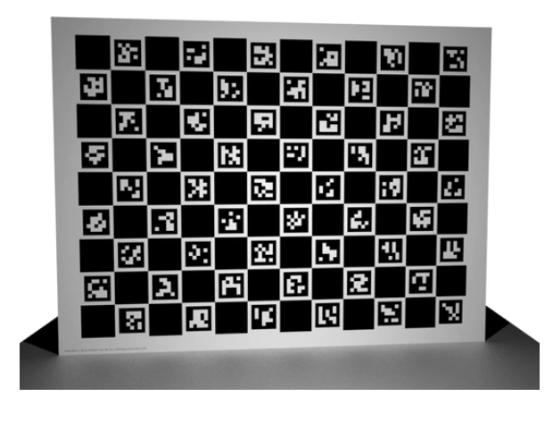

## Getting started

  - [Installation](#installation)
    - [Clone ATOM repository and install dependencies](#clone-atom-repository-and-install-dependencies)
    - [Clone RViz fork](#clone-rviz-fork)
    - [Set environment variables](#set-environment-variables)
  - [Calibration patterns](#calibration-patterns)
  - [Basic usage](#basic-usage)
    - [Create a calibration package](#create-a-calibration-package)
    - [Configure a calibration package](#configure-a-calibration-package)
    - [Set initial estimate](#set-initial-estimate)
    - [Collect data](#collect-data)
    - [Dataset playback](#dataset-playback)
    - [Calibrate sensors](#calibrate-sensors)

### Installation

#### Clone ATOM repository and install dependencies

Clone the atom repository to a directory soemwhere inside your catkin workspace:

    git clone https://github.com/lardemua/atom

then install requirements.

    sudo pip3 install -r requirements.txt


#### Clone RViz fork

Some of the functionalities in ATOM, i.e., depth semi-automatic labeling and depth manual labeling, make use of a 
[special RViz fork](https://github.com/miguelriemoliveira/rviz) that allows for mouse clicking functionality. 

If you are interested in using one of these functionalities you have to clone it to your catkin workspace:

    git clone https://github.com/miguelriemoliveira/rviz

!!! Warning "To be integrated into RVIZ"

    The functionality extends the image display to suport mouse clicking. We are working on integrating this in the RViz main branch, but this is not available yet.
    More information here:

    [https://github.com/ros-visualization/rviz/issues/916](https://github.com/ros-visualization/rviz/issues/916)

    [https://github.com/ros-visualization/rviz/pull/1737](https://github.com/ros-visualization/rviz/pull/1737)

#### Set environment variables

We often use two enviroment variables to allow for easy cross machine access to bagfiles and datasets. If you want to use these you can also add these lines to your _.bashrc_ or _.zhsrc_, adjusting the paths according to your case:

```bash
export ROS_BAGS="$HOME/bagfiles"
export ATOM_DATASETS="$HOME/datasets"
```

and then you can refer to these environment variables when providing paths to atom scripts, e.g.:

```bash
roslaunch <my_robot_calibration> calibrate.launch dataset_file:=$ATOM_DATASETS/<my_dataset>/dataset.json
```

and you can also refer to them inside the [calibration configuration file](https://github.com/lardemua/atlascar2/blob/0c065508f325fb57e0439c1ba2e00f9468cd73e7/atlascar2_calibration/calibration/config.yml#L14)


### Calibration patterns

ATOM can be used with [chessboard](https://docs.opencv.org/4.x/d9/d0c/group__calib3d.html#ga93efa9b0aa890de240ca32b11253dd4a) or [charuco](https://docs.opencv.org/4.x/df/d4a/tutorial_charuco_detection.html) calibration patterns.

To calibrate our systems we purchased charuco calibration patterns from [calib.io](https://calib.io/products/charuco-targets?variant=9400455004207.


<figure markdown align=center>
  {width="60%" }
  <figcaption align=center>An example of a Charuco calibration pattern.</figcaption>
</figure>

!!! Note
    Charuco boards are preferable to chessboard patterns, because of two main reasons: the first is that the charuco detection is more more efficient when compared to the chessboard detection; the second is that the charuco pattern is detected even if it is only partially visible in the image, which is very usefull when the sensors in your system have small overlapping fields of view.


### Basic usage

Unlike most other calibration approaches, **ATOM** offers tools to address the complete calibration pipeline. These are
instructions for quick starting your robotic system calibration. If you need more details read through
the [detailed description](procedures.md) below.


#### Create a calibration package 

```bash
rosrun atom_calibration create_calibration_pkg --name <my_robot_calibration>
```

#### Configure a calibration package

Edit the file:

   <my_robot_calibration\>/calibration/config.yml_ with your system information.

and then run:

```bash
rosrun <my_robot_calibration> configure 
```

#### Set initial estimate 

ATOM provides interactive tools based on rviz that allow the user to set the pose of the sensors to be calibrated, while receiving visual feedback.

!!! Optional

    If you consider that your initial sensor poses are already accurate, you may skip this procedure.

To use launch:

```bash
roslaunch <my_robot_calibration> set_initial_estimate.launch 
```

#### Collect data 

Collecting data produces an ATOM dataset, which is then used for calibrating the system.

```bash
roslaunch <my_robot_calibration> collect_data.launch output_folder:=~/datasets/<my_dataset> 
```

#### Dataset playback

Dataset playback offers the possibility to visualize and correct the labels automatically produced during the collection stage.

!!! Optional

    If you trust that the automatic labels are correct, you may skip this procedure.


First launch the visualizer:
   
```bash
roslaunch <my_robot_calibration> dataset_playback.launch
```

and then:

```bash
rosrun atom_calibration dataset_playback -json $ATOM_DATASETS/<my_robot_calibration>/<your_dataset>/dataset.json -uic -si  -ow
```

#### Calibrate sensors 

Finally, run an optimization that will calibrate your sensors. First launch:

```bash
roslaunch <my_robot_calibration> calibrate.launch 
```

Then, in a second terminal, run the calibrate script:

```bash
rosrun atom_calibration calibrate -json $ATOM_DATASETS/<my_robot_dataset>/dataset.json -v -rv -si 
```

There are many different options to customize the calibration. Check the [detailed description](procedures.md#calibrate) to know more.

