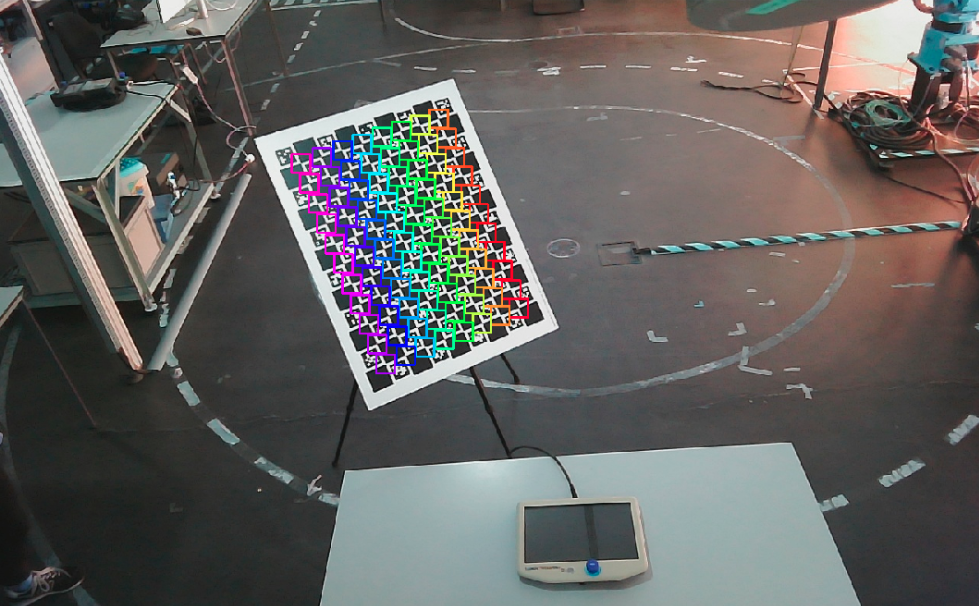
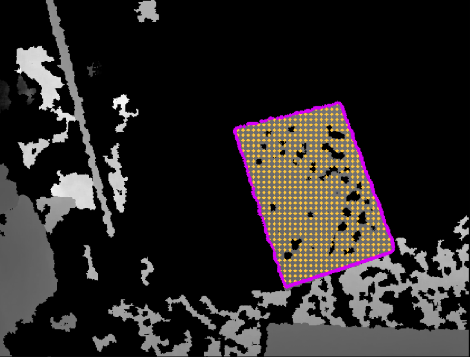
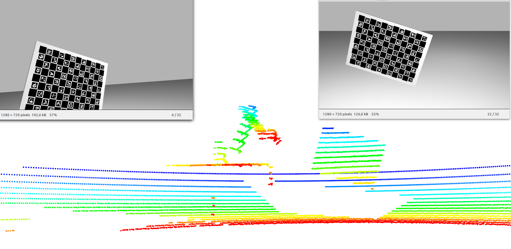
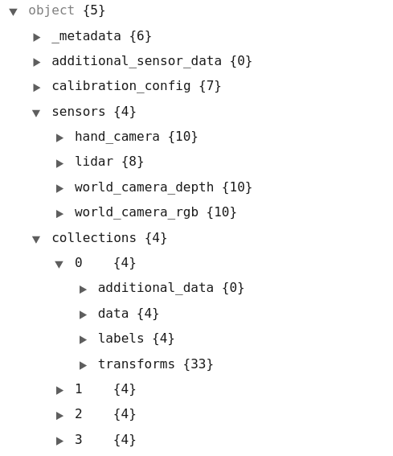

<figure markdown align=center>
  {width="60%" }
  <figcaption align=center></figcaption>
</figure>

## ATOM

- [ATOM](#atom)
  - [What is ATOM?](#what-is-atom)
  - [Calibration Pipeline](#calibration-pipeline)
    - [Robotic System Configuration](#robotic-system-configuration)
    - [Data Logging](#data-logging)
    - [Initial Positioning of Sensors](#initial-positioning-of-sensors)
    - [Data Collection and Labeling](#data-collection-and-labeling)
    - [Dataset playback](#dataset-playback)
    - [Calibration](#calibration)
    - [Calibration Evaluation](#calibration-evaluation)
    - [Running the calibrated system](#running-the-calibrated-system)
  - [What is a label?](#what-is-a-label)
  - [What is a collection?](#what-is-a-collection)
  - [What is an ATOM dataset?](#what-is-an-atom-dataset)
  - [ROS1 and ROS2](#ros1-and-ros2)

### What is ATOM?

[ATOM](https://github.com/lardemua/atom) is a calibration framework using the **A**tomic **T**ransformations **O**ptimization **M**ethod. 

<a href="https://github.com/lardemua/atom">https://github.com/lardemua/atom</a>

It contains a set of calibration tools for multi-sensor, multi-modal, robotic systems, based on the optimization of atomic transformations, as provided by a [ROS](https://www.ros.org/) based robot description. Moreover, it provides several scripts to facilitate all the steps of a calibration procedure.

<!--  -->

If this work is helpful for you please cite [our publications](acknowledgment.md#citing-atom).

### Calibration Pipeline

In order to calibrate a robotic system one needs to carry out several tasks, such as acquiring data, labeling data, executing the calibration, interpreting the result of the calibration, etc.
ATOM provides several scripts to address all the stages of a calibration procedure. 
These scripts are seamlessly integrated into [ROS](https://www.ros.org/), and make use of [RViz](http://wiki.ros.org/rviz) to provide extensive visualization functionalites.
We have divided the calibration procedure into several stages, shown in the scheme below.

<figure markdown align=center>
  {width="80%" }
  <figcaption align=center>ATOM calibration pipeline.</figcaption>
</figure>

The greyed out boxes  are steps considered to be out of the scope of ATOM, i.e., these are tasks one should do in order to properly configure and run a robotic system in ROS, even if ATOM is not going to be used. Dashed line boxes represent steps which are optional, i.e., they may improve the calibration but are not essential to the procedure. 

Below we describe each of these stages, giving examples for the [MMTBot](examples.md#mmtbot).

#### Robotic System Configuration 

 Robotic System Configuration concerns the design and implementation of your robotic system in ROS. It generally involves the writing of an [UDRF](http://wiki.ros.org/urdf) or a [xacro](http://wiki.ros.org/xacro) file that describes the links and joints of your robotic system, among other things.
If you are not familiar with this there are ROS tutorials to [build your robot URDF](http://wiki.ros.org/urdf/Tutorials/Building%20a%20Visual%20Robot%20Model%20with%20URDF%20from%20Scratch) and also to [create your robot xacro](http://wiki.ros.org/urdf/Tutorials/Using%20Xacro%20to%20Clean%20Up%20a%20URDF%20File).
 
!!! Note
    To calibrate your robot with ATOM, we recommend using xacro files instead of urdfs. 
 
This stage may also include de configuration of a simulation of your system in [Gazebo](https://gazebosim.org/home).

Typically one creates a couple of ros packages for our robot, as described below.

**<my_robot\>_description** ros package contains the xacro files that describe your robot. It sometimes also contains cad models inside a models folder. An example from [MMTBot is here](https://github.com/miguelriemoliveira/mmtbot/tree/main/mmtbot_description).

**<my_robot\>_bringup** ros package contains the launch files used to bringup your robotic system. Tipically there is a **bringup.launch** that starts the complete system.
An example from the [MMTBot](https://github.com/miguelriemoliveira/mmtbot/blob/main/mmtbot_bringup/launch/bringup.launch).

#### Data Logging

Data Logging is the procedure by which a [ros bagfile](http://wiki.ros.org/Bags) is recorded to be used in the calibration later on.

You may record data by [calling rosbag record](http://wiki.ros.org/rosbag/Tutorials/Recording%20and%20playing%20back%20data) directly, e.g.:

    rosbag record /topic1 ... /topicN -o output.bag

We typically have a roslaunch file to record data and produce a bagfile for each robotic system. Here's the example for [MMTBot](https://github.com/miguelriemoliveira/mmtbot/blob/main/mmtbot_bringup/launch/record.launch).

A bagfile should contain several topics, namely transformations and joint state messages, as well as messages produced by the sensors in the system. For example, in the case of MMTBot, which has sensors **world_camera**, **hand_camera** and **lidar**, we record the following topics:

   - /tf
   - /tf_static
   - /joint_states
   - /world_camera/rgb/image_raw/compressed
   - /world_camera/rgb/camera_info
   - /hand_camera/rgb/image_raw/compressed
   - /hand_camera/rgb/camera_info
   - /lidar/points

    

#### Initial Positioning of Sensors

The goal of this stage is to allow the user to define interactively the poses of each sensor, so that the optimization starts close to the optimal solution and thus avoids local minima. 
This stage may be skipped if the transformations from the URDF are believed to be "sufficiently" accurate.

More details [here](procedures.md#set-an-initial-estimate).

#### Data Collection and Labeling

This stage reads the bagfile and allows the user to assist the labeling procedure, i.e., the identification of the calibration pattern in the data of the sensors, and then to decide when to save each collection. The output is an [ATOM dataset](#what-is-an-atom-dataset).

More details [here](procedures.md#collect-data).

#### Dataset playback

This stage is used to review ATOM datasets. The reviewing may identify incorrect labels, which can be corrected through manual annotation. It produces a corrected [ATOM dataset](#what-is-an-atom-dataset).

 More details [here](procedures.md#dataset-playback).

#### Calibration

This is were finally the system is calibrated. ATOM provides extensive visualization functionalities so that it is possible to observe how the calibration is performing.

More details [here](procedures.md#calibrate).

#### Calibration Evaluation

ATOM provides several scripts designed to measure the accuracy of the calibration. 
These tools are pairwise evaluations, which means it is possible to compare the accuracy of ATOM with other state of the art pairwise approaches.

More details [here](evaluations.md).

#### Running the calibrated system

After calibration ATOM produces a calibrated URDF file which can be directly used in ROS.

If you get here unscathed, you are a very lucky person :-)  ... Enjoy!

### What is a label?

A label is a set of data points selected from the complete sensor data, obtained through a labeling or pattern detection procedure.
The representation of a label differs according to the sensor modality, as detailed next.

RGB camera labels are a list of image pixel coordinates of the corners of the pattern.

<figure markdown align=center>
  {width="60%" }
  <figcaption align=center>Labels for RGB modality.</figcaption>
</figure>

3D Lidar labels contain the list of 3D point coordinates of the Lidar data points that belong to the pattern.
In addition to this, 3D Lidar labels also contain a list of 3D points of the physical boundaries of the pattern.

<figure markdown align=center>
  {width="50%" }
  <figcaption align=center>Labels for the 3D Lidar modality. Small green spheres are the pattern support points, larger green spheres are the points annotated as boundaries of the pattern.</figcaption>
</figure>

Depth modality labels contain a list of image pixel coordinates that are annotated to be inside the pattern. In addition to this, depth labels also contain a set of pixel coordinates of the boundaries of the pattern.

<figure markdown align=center>
  {width="50%" }
  <figcaption align=center>Labels for the depth modality. Pattern support points in yellow, and boundaries in pink.</figcaption>
</figure>

### What is a collection?

A collection is a recording of the data from all the sensors in the system at a particular time instant selected by the user. Collections also contain information about labels for the sensor data, as well as the state of the robotic system at that time, i.e., all the transformations.

<figure markdown align=center>
  {width="100%" }
  <figcaption align=center>Sensor data from an MMTBot collection.</figcaption>
</figure>

!!! Info "Incomplete collections"
    A collection is referred to as an **incomplete collection** when it is not possible to detect the pattern in at least one of the sensors of the robotic system.

### What is an ATOM dataset?

An ATOM dataset is a folder which contains data used for the calibration of a robotic system. Every ATOM dataset contains a **dataset.json** which provides details about the dataset, such as the defined configuration, the number of sensors, etc. 

Several scripts in the calibration pipeline require an ATOM dataset, but it is worth mentioning that the files are also human readable. 

Below you can see the structure of an ATOM dataset. 

<figure markdown align=center>
  {width="60%" }
  <figcaption align=center>Structure of an ATOM dataset json file.</figcaption>
</figure>

A **dataset.json** file contains a **_metadata** field, where details about the date, user and others are stored. It also contains a **calibration_config**, which is a copy of the state of the configuration file at the time of creation of the dataset. The **sensors** field describes each of the sensors in the system, in particular those selected to be calibrated. 

Finally, the **collections** field contains several collections, i.e. snapshots of data. Each collection contains a subfield **data**, that stores a dictionary obtained through the [conversion of the ROS message to a python dictionary](http://wiki.ros.org/rospy_message_converter), the subfield **labels** contains information about annotations (automatic or manual) of each sensor data, and the subfield **transforms** contains all the transformations published at (or near) the time of the collection.

In addition to the **dataset.json** file, ATOM datasets also contain dedicated files for larger data blobs, such as point clouds or images, which are saved separately in the same folder.

Because the transformations are stored for each collection, it is possible to recover the complete state of the robotic system at the time of each collection. 
ATOM then provides visualization functionalities to display all collections at once. Below we can see the different poses of the manipulator and the calibration pattern for each collection of an MMTBot dataset.

<figure markdown align=center>
  {width="90%" }
  <figcaption align=center>Several collections in an MMTBot dataset.</figcaption>
</figure>

Here is an [ATOM dataset example from LARCC](https://jsoneditoronline.org/#left=cloud.d9efaa274cb44579ad73553dea513ed8).

### ROS1 and ROS2

At the moment, ATOM is only supported in ROS1 (Noetic), Ubuntu 20.04 LTS.

We have plans to work on a ROS2 version in the near future.
