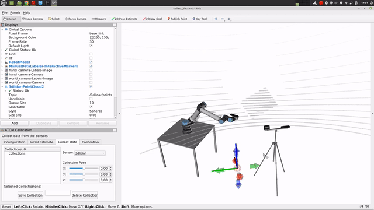

## Calibration procedures

- [Calibration procedures](#calibration-procedures)
  - [Create a calibration package](#create-a-calibration-package)
  - [Configure a calibration package](#configure-a-calibration-package)
      - [Recording compressed images](#recording-compressed-images)
      - [Throttling topics](#throttling-topics)
      - [Using a different configuration file](#using-a-different-configuration-file)
      - [Using tfs instead of the xacro file](#using-tfs-instead-of-the-xacro-file)
  - [Set an initial estimate](#set-an-initial-estimate)
    - [Visualizing sensor frustums](#visualizing-sensor-frustums)
  - [Collect data](#collect-data)
    - [RGB camera labeling](#rgb-camera-labeling)
    - [3D Lidar labeling](#3d-lidar-labeling)
    - [Depth camera labeling](#depth-camera-labeling)
    - [2D Lidar labeling](#2d-lidar-labeling)
  - [Dataset playback](#dataset-playback)
    - [Correcting 3D Lidar labels](#correcting-3d-lidar-labels)
    - [Correcting Depth labels](#correcting-depth-labels)
  - [Calibrate](#calibrate)
    - [Calibrating intrinsic parameters](#calibrating-intrinsic-parameters)
    - [Two stage calibration for robotic systems with an anchored sensor](#two-stage-calibration-for-robotic-systems-with-an-anchored-sensor)
  
To calibrate your robot you must define your robotic system, (e.g. <my_robot\>). You should also have a **system
description** in the form of an [urdf](http://wiki.ros.org/urdf) or a [xacro](http://wiki.ros.org/xacro) file(s). This is normally stored in a ros package named **<my_robot\>_description**.
In addition to this, **ATOM** requires a bagfile with a recording of the data from the sensors you wish to calibrate.
This was covered in detail in [here](index.md#calibration-pipeline).

Transformations in the bagfile (i.e. topics /tf and /tf_static) will be ignored, so that they do not collide with the
ones being published by the [robot_state_publisher](http://wiki.ros.org/robot_state_publisher). Thus, if your robotic system contains moving parts, the bagfile should also record the [sensor_msgs/JointState](http://docs.ros.org/en/lunar/api/sensor_msgs/html/msg/JointState.html) message.

!!! Note
    It is also possible to use the transformations in the bagfile instead of using the xacro description and the robot state publisher to produce them. 
    See section on [using tfs instead of a xacro file](#using-tfs-instead-of-the-xacro-file).


To reduce the bag size, it may contain compressed images instead of raw images, since **ATOM** can decompress them while playing back the bagfile. 
Here is an example of a [launch file](https://github.com/lardemua/atlascar2/blob/master/atlascar2_bringup/launch/record_sensor_data.launch)
which records compressed images.

We consider this to be part of the normal configuration of your robotic system in ROS, so ATOM assumes this is already done. 
In any case if you need inspiration you can take a look at the [calibration examples](examples.md) and how we configured our systems.


### Create a calibration package

Assuming you have your robotic system setup, you can start creating the calibration package.
You should create a calibration ros package specific for your robotic system. **ATOM** provides a script for this:

```bash
rosrun atom_calibration create_calibration_pkg --name <my_robot_calibration>
```

This will create the ros package <my_robot_calibration> in the current folder, but you can also specify another folder,
e.g.:

```bash
rosrun atom_calibration create_calibration_pkg --name ~/my/path/<my_robot_calibration>
```

### Configure a calibration package

Once your calibration package is created you will have to configure the calibration procedure by editing the
_<my_robot_calibration>/calibration/config.yml_ file with your system information.

The file contains several comments to provide clues on how to configure it.
Here are examples of calibration **config.yml** files for
an [autonomous vehicle](https://github.com/lardemua/atlascar2/blob/master/atlascar2_calibration/calibration/config.yml)
and for [MMTBot](https://github.com/miguelriemoliveira/mmtbot/blob/main/mmtbot_calibration/calibration/config.yml), also shown below:


```yaml
#
#           █████╗ ████████╗ ██████╗ ███╗   ███╗
#          ██╔══██╗╚══██╔══╝██╔═══██╗████╗ ████║
#          ███████║   ██║   ██║   ██║██╔████╔██║
#          ██╔══██║   ██║   ██║   ██║██║╚██╔╝██║
#   __     ██║  ██║   ██║   ╚██████╔╝██║ ╚═╝ ██║    _
#  / _|    ╚═╝  ╚═╝   ╚═╝    ╚═════╝ ╚═╝     ╚═╝   | |
#  | |_ _ __ __ _ _ __ ___   _____      _____  _ __| | __
#  |  _| '__/ _` | '_ ` _ \ / _ \ \ /\ / / _ \| '__| |/ /
#  | | | | | (_| | | | | | |  __/\ V  V / (_) | |  |   <
#  |_| |_|  \__,_|_| |_| |_|\___| \_/\_/ \___/|_|  |_|\_\
#  https://github.com/lardemua/atom

# This yaml file describes your calibration!

# You can start by defining your robotic system.
# This is the URDF file (or xacro) that describes your robot.
# Every time a path to a file is requested you can use
#
#   - Absolute Path
#       Example 1: /home/user/ros_workspace/your_package/urdf/description.urdf.xacro
#       Example 2: file://home/user/ros_workspace/your_package/urdf/description.urdf.xacro
#
#   - Path Expansion
#       Example 1: ${HOME}/user/${YOUR_VARIABLE}/your_package/urdf/description.urdf.xacro
#       Example 2: ~/user/ros_workspace/your_package/urdf/description.urdf.xacro
#
#       NOTE: It is up to you to guarantee the environment variable exists.
#
#   - ROS Package Reference
#       Example: package://your_package/urdf/description.urdf.xacro
#
description_file: "package://mmtbot_gazebo/urdf/mmtbot.urdf.xacro"
#description_file: "package://mmtbot_gazebo/urdf/mmtbot.urdf.xacro"

# The calibration framework requires a bagfile to extract the necessary data for the calibration.
bag_file: "$ROS_BAGS/mmtbot/test_depth2.bag"

# You must define a frame of reference for the optimization process.
# It must exist in the transformation chains of all the sensors which are being calibrated.
world_link: "world"

# ATOM will calibrate the extrinsic parameters of your sensors.
# In this section you should discriminate the sensors that will be part of the calibrations.
sensors:
  # Each key will define a sensor and its name, which will be use throughout the calibration.
  # Each sensor definition must have the following properties:
  #       link:
  #           The frame of the sensor's data (i.e. the header.frame_id).
  #       parent_link:
  #           The parent link of the transformation (i.e. link) to be calibrated.
  #       child_link:
  #           This is the transformation (i.e. link) that we be optimized.
  #       topic_name:
  #           Name of the ROS topic that contains the data produced by this sensor.
  #           If you are calibrating an camera, you should use the raw image produced by the
  #           sensors. Additionally, it the topic is an image it will automatically use the
  #           respective `camera_info` topic.

  hand_camera:
    link: "hand_camera_rgb_optical_frame"
    parent_link: "flange"
    child_link: "hand_camera_link"
    topic_name: "/hand_camera/rgb/image_raw"
    throttle: 5
    modality: "rgb"

  world_camera_rgb:
    link: "world_camera_rgb_optical_frame"
    parent_link: "world_camera_link"
    child_link: "world_camera_rgb_frame"
    topic_name: "/world_camera/rgb/image_raw"
    modality: "rgb"

  lidar:
    link: "lidar"
    parent_link: "tripod_left_support"
    child_link: "lidar_base_link"
    topic_name: "/lidar/points"
    modality: "lidar3d"

# The calibration requires a detectable pattern.
# This section describes the properties of the calibration pattern used in th calibration.
calibration_pattern:
  # The frame id (or link) of the pattern.
  # This link/transformation will be optimized.
  link: "pattern_link"

  # The parent frame id (or link) of the pattern.
  # For example, in hand-eye calibration the parent link
  # of the pattern can be the end-effector or the base of the arm
  parent_link: "world"

  # Defines if the pattern link is the same in all collections (i.e. fixed=true),
  # or each collection will have its own estimate of the link transformation.
  # Note: if you plan to have the pattern fixed, while the moving the rigidly attached sensors, 
  # this is equivalent to having the sensors fixed and the pattern moving, so you should use fixed=false.
  fixed: false

  # The type of pattern used for the calibration.
  # Supported pattern are: chessboard, charuco
  pattern_type: "charuco"

  # If the pattern type is "charuco" you need to define
  # the aruco dictionary used by the pattern.
  # See https://docs.opencv.org/trunk/dc/df7/dictionary_8hpp.html
  dictionary: "DICT_5X5_100"

  # Mesh file (collada.dae or stl) for showing pattern on rviz. URI or regular path.
  mesh_file: "package://mmtbot_gazebo/models/charuco_800x600/charuco_800x600.dae"

  # The border width from the edge corner to the pattern physical edge.
  # Used for 3D sensors and lidars.
  # It can be a scalar (same border in x and y directions), or it can be {'x': ..., 'y': ,,,}
  border_size: { "x": 0.04, "y": 0.03 }

  # The number of corners the pattern has in the X and Y dimensions.
  # Note: The charuco detector uses the number of squares per dimension in its detector.
  # Internally we add a +1 to Y and X dimensions to account for that.
  # Therefore, the number of corners should be used even for the charuco pattern.
  dimension: { "x": 11, "y": 8 }

  # The length of the square edge.
  size: 0.06

  # The length of the charuco inner marker.
  inner_size: 0.045

# Miscellaneous configuration

# If your calibration problem is not fully constrained you should anchored one of the sensors.
# This makes it immovable during the optimization.
# This is typically referred to as gauge freedom.
anchored_sensor: "world_camera_rgb"

# Max time delta (in milliseconds) between sensor data messages when creating a collection.
max_duration_between_msgs: 1000

```

After filling the config.yml file, you should run the package configuration:

```bash
rosrun <my_robot_calibration> configure 
```

This will go through a series of verifications to check if the configuration is valid, if the bagfile exists and contains the necessary transformations, among many others.
Once the verifications signal a correct calibration configuration, a set of files is automatically created inside your 
**<my_robot\>_calibration** ros package, as shown below:

```bash
├<my_robot>_calibration
├── launch
│   ├── calibrate.launch
│   ├── collect_data.launch
│   ├── dataset_playback.launch
│   ├── playbag.launch
│   └── set_initial_estimate.launch
├── rviz
│   ├── calibrate.rviz
│   ├── collect_data.rviz
│   ├── dataset_playback.rviz
│   └── set_initial_estimate.rviz
├── scripts
│   └── configure
└── urdf
    ├── initial_estimate.urdf.xacro
├── calibration
│   ├── config.yml
│   └── summary.pdf

```

The **launch** directory contains automatically created launch files used to launch each of the calibration stages.
The **rviz** folder contains several rviz configuration files used to setup the visualization of each stage.
The **urdf** folder contains a symbolic link to the xacro file of <my_robot\> and, after calibration, will contain a calibrated urdf. 
Finally, the **calibration** folder contains the configuration file (config.yml). 

This folder also contains an automatically produced schematic of the configuration of the calibration named [summary.pdf](img/summary_example.pdf).
It is used to inspect the configuration of the calibration and assess if the configuration is doing what we intended.
Atomic transformations to be estimated are marked in blue, sensor coordinate systems, i.e. the coordinate systems in which sensors produce their data are marked in green, and the selected world coordinate frame is highlighted in red.

<figure markdown align=center>
  {width="120%" }
  <figcaption align=center>Summary of a calibration configuration (MMTBot).</figcaption>
</figure>


##### Recording compressed images

In case the topics from RGB camera(s) are published using the [ROS image transport](http://wiki.ros.org/image_transport), it is possible to record the compressed image topic instead of the raw image topic as in [this example](index.md#data-logging). During the configuration of your calibration package, ATOM will detect that these are compressed topics and automatically generate a decompressing mechanism in the launch files. 

The advantage is that you get much smaller bag files since they contain compressed images.
This may be critical for large systems such as [LARCC](examples.md#larcc), where the data output may reach over 1GB per minute.

##### Throttling topics

For an offline calibration procedure, speed is not critical. Thus, it is possible to configure a [ROS topic throttler](http://wiki.ros.org/topic_tools/throttle) for your sensor messages, if they have been recorded in a higher than necessary frequency.
For that just add a field **throttle** to the section of the corresponding sensor in your calibration config.yaml file.


##### Using a different configuration file

It is also possible to configure your calibration package with a different configuration file, in the case you have
multiple configurations with multiple config.yml files. There are also other options to run a custom configuration, i.e.:

```bash
usage: rosrun <my_robot_calibration> configure -n NAME -cfg CONFIG_FILE
```
##### Using tfs instead of the xacro file

Sometimes it may be preferable to use the transformations in the bagfile instead of the ones produced by the xacro description. To do this use the --use_tfs option when configuring your package:

```bash
usage: rosrun <my_robot_calibration> configure -n NAME -utf
```

!!! Note
    A previous version of the configure script used a bash based script (currently it is python based), which may not have all the options listed. If the <my_robot_calibration> package was created some time ago, you may still have the bash based script. 

    In that case you can update the configure script by running:

         rosrun atom_calibration update_configure_script -n <my_robot_calibration>

### Set an initial estimate

Iterative optimization methods such as ATOM are sensitive to the initial parameter configuration. 
ATOM uses several groups of optimization parameters and uses distinct strategies to initialize each class. 
The most important group, sensor poses, may be manually initialized to ensure that the initial estimate is plausible and thus reduce the likelihood of encountering a local minima.

ATOM provides an interactive framework based on rviz which allows the user to set the pose of the sensors while having immediate visual feedback.
The system configures an [RViz interactive marker](http://wiki.ros.org/rviz/Tutorials/Interactive%20Markers%3A%20Getting%20Started) for each sensor to be calibrated, so that it is possible to move the sensor in RViz.

During this procedure one may use several visual clues to better position the sensors, i.e. it is possible to see the CAD model of the sensors and the rest of the structure of the robotic system or one could observe the amount of overlap between sensors.

To set an initial estimate run:

```bash
roslaunch <my_robot_calibration> set_initial_estimate.launch 
```

Here are a couple of examples of setting the initial estimate:

<figure markdown align=center>
  {width="100%" }
  <figcaption align=center>Setting initial estimate of sensor poses in the AgrobV2.</figcaption>
</figure>

<figure markdown align=center>
  {width="100%" }
  <figcaption align=center>Setting initial estimate of sensor poses in the AtlasCar2.</figcaption>
</figure>

<figure markdown align=center>
  {width="100%" }
  <figcaption align=center>Setting initial estimate of sensor poses in the IRIS UR10e.</figcaption>
</figure>

#### Visualizing sensor frustums

ATOM provides a way to visualize the frustums of RGB and Depth cameras. These may be useful to get a clue about the overlap between sensors, or the amount of coverage of a work volume. Below you can see the frustum of two rgb cameras. One of the cameras is positioned on the end-effector of the manipulator, and when it moves, so does its frustum.

This functionality is only available in the set initial estimate stage.

<figure markdown align=center>
  {width="100%" }
  <figcaption align=center>Visualizing frustum of RGB sensors in the MMTBot.</figcaption>
</figure>

### Collect data 

To run a system calibration, one requires data from the sensors collected at different time instants. We refer to these snapshots of data as [collections](index.md#what-is-a-collection), and a set of collections as an [ATOM dataset](index.md#what-is-an-atom-dataset). 

To collect data, use:

```bash
roslaunch <my_robot_calibration> collect_data.launch output_folder:=$ATOM_DATASETS/<your_dataset_folder>
```

The script launches a fully configured rviz window. The user observes the data playback and **decides when a collection should be saved** by clicking a green sphere that appears in the scene. 

!!! Info "How many collections do I need?"
    The number of collections required to accurately calibrate a system varies according to the number, modality and positioning of the sensors. 
    Empirically we found that a figure around 20 or 30 collections is usually sufficient for estimating an accurate calibration.
    That's about the same number of images you need when calibrating a stereo system with OpenCV. Of course this highly depends on your system and the amount
    of overlap there is between the sensors.

!!! Info "What is a good bagfile for recording an ATOM dataset?"
    Each collection in an ATOM dataset will contain data from all the sensors in the system. All this data is assumed to be captured at the reference time stamp of that collection. 
    In other words, ATOM assumes that the data from the sensors in a collection is synchronized. 

    There are some robotic systems where it is straightforward to implement synchronization mechanisms, e.g., image acquisition hardware triggers in stereo camera systems.  
    However, these solutions are very specialized and cannot be relied upon for the general case of multi-sensor, multi-modal systems. For example, it is not so easy to synchronize the acquisition of images from a camera with range data from a LiDAR.

    The solution adopted in ATOM is to transfer the responsibility of selection of these moments when a collection should be recorded to the user. More often than not, sensor data is not synchronized. However, if the sensors are observing a static scene, it is possible to safely assume that the sensor data is "virtually synchronized" because, even if the data is collected at different instants in time, it will observe the same static scenario.

    To ensure this, what we do during the recording of the bagfile for calibration is to plan in advance the moments where we will record collections, and ensure that at those moments the scene has been static for a duration longer than the estimated largest possible sensor data time differential. 
    
    In practice, in our bagfiles, we move the pattern from position A to position B (moving the pattern at normal speed), but then hold the pattern static in position B for some time, e.g 3 to 5 seconds, in anticipation that the collection will be recorded once these seconds elapse, a time in which is is safe to assume that the scene has remained static for a _long enough_ duration. 
    
    Here is an [example of a calibration bagfile](https://youtu.be/cVhibWXSGsg) where the described motion of the calibration pattern is visible. Having the user holding the pattern static will always results is small displacements of the calibration pattern. Thus, for more complex systems, or when a high accuracy is required, we use a [tripod to hold the pattern still](https://youtu.be/CB22PyhY4g4). 
    
!!! Info "Should the pattern be held in a special pose?"

    Short answer: **Yes**, if LiDAR or depth sensors are used the pattern should be held somewhat diagonally.

    Long answer: In order to calibrate LiDAR or depth sensor modalities ATOM uses a cost function which uses the lateral physical boundaries of the pattern as landmarks for guiding the calibration. If the pattern is held in a straight up vertical pose, the lateral alignment will be equally valued regardless of the height at which the pattern is held. This results in redundancy in the estimation of the pattern pose, which pollutes the calibration procedure and often ends up in non-accurate calibrations. ATOM tackles this with a simple solution: [we avoid holding the calibration pattern in a straight up pose](https://www.youtube.com/watch?v=eII_ptyMq5E&list=PLQN09mzV5mbKtqGH1ofy-7GZvbNi-iw8U&index=6), and hold it in one (or more) diagonal pose(s) when recording calibration bagfiles.  


It is also possible to add additional parameters to configure several aspects of the script. See below all the options.

!!! Tip "Additional parameters for collect_data.launch"

    | Argument  | Function | 
    |:---:|:---:|
    |  overwrite | overwrites previous dataset without asking for confirmation   |
    | bag_rate | Defines the playback rate of the bagfile | 
    | bag_start | Start time for playback | 
    | bag_file | Name of bagfile to playback | 
    | ssl | A string to be evaluated that indicates if a sensor should be labelled. |

    One example using all the parameters above:

        roslaunch <my_robot_calibration> collect_data.launch output_folder:=$ATOM_DATASETS/<your_dataset_folder> overwrite:=true bag_rate:=0.5 bag_start:=10 ssl:='lambda name: name in ["s1", "s2"]' 

When you launch the data collection script, it automatically starts data labeling processes adequate for each sensor in your robotic system.
As such, the data is being continuously labeled as the bagfile is played.

Depending on the modality of the sensors in the system the labeling may be automatic or fully automatic.
Below we detail how each of the labelers operate.

#### RGB camera labeling

RGB cameras have a fully automatic pattern detection. ATOM uses off the shelf [chessboard](https://docs.opencv.org/4.x/d9/d0c/group__calib3d.html#ga93efa9b0aa890de240ca32b11253dd4a) or [charuco](https://docs.opencv.org/4.x/df/d4a/tutorial_charuco_detection.html) calibration pattern detectors.
Also, it provides an rviz configuration which subscribes annotated images received from the pattern detectors. You can check if the detection is working by observing the overlays of top of the images.

<figure markdown align=center>
  {width="100%" }
  <figcaption align=center>Automatic labeling of RGB images (IrisUA - UR10e).
</figcaption>
</figure>

!!! Note "Use charuco boards"
    Charuco boards are preferable to chessboard patterns, because of two main reasons: the first is that the charuco detection is more more efficient when compared to the chessboard detection; the second is that the charuco pattern is detected even if it is only partially visible in the image, which is very useful when the sensors in your system have small overlapping fields of view.

#### 3D Lidar labeling

3D Lidar labeling is a semi-automatic procedure. The idea is that the user moves an rviz marker close to where the pattern is present in the lidar point cloud.  

<figure markdown align=center>
  {width="100%" }
  <figcaption align=center>Setting the seed point in 3D Lidar data for semi-automatic labeling (MMTBot).</figcaption>
</figure>

After setting this seed position, the system continues to track the patterns pose over the next frames, even if it moves,
as you can see below:

<figure markdown align=center>
  {width="100%" }
  <figcaption align=center>Automatic 3D Lidar labeling and creating an ATOM dataset (AgrobV2).</figcaption>
</figure>

!!! Warning "Tracking limitations"

    The tracking procedure may fail if the pattern is too close to another object, as for example the ground plane. This can be solved by making sure the pattern is sufficiently far from all other objects, or during the dataset playback stage. 

#### Depth camera labeling

The labeling of depth cameras is a semi-automatic procedure. It is done by clicking the depth image in rviz. The user should click somewhere inside the pattern, and then the system carries on the tracking of the pattern even if it moves. The user may reset the procedure by clicking again on the image.

<figure markdown align=center>
  {width="100%" }
  <figcaption align=center>Labeling of depth data (LARCC).</figcaption>
</figure>


!!! Warning "RViz fork required"

    Learn about this [here](getting_started.md#clone-rviz-fork).


#### 2D Lidar labeling

The labeling of the 2D Lidars is very similar to the labeling of 3D Lidars. The user sets the seed point where the lidar points are observing the pattern, and then the pattern is tracked.

<figure markdown align=center>
  {width="100%" }
  <figcaption align=center>Setting the seed point in 2D Lidar data for semi-automatic labeling (AtlasCar2).</figcaption>
</figure>

!!! Warning "May be deprecated"
    The 2D Lidar semi-automatic labeling was last used in 2019, so it may be deprecated. If you are interested on having this functionality [create an issue](https://github.com/lardemua/atom/issues) with a request.


### Dataset playback 

The dataset playback is used to review and eventually correct the automatic labels produced during the [collection of data](#collect-data).
Ideally, the bulk of the labels produced automatically during the collect data stage should be correct, but a few incorrect annotations will disrupt the calibration. As such, a review of the annotations is recommended. You may skip it if you feel that the automatic labeling went very well.

To run the dataset playback, first launch the visualization:

    roslaunch <my_robot_calibration> dataset_playback.launch

and then the dataset_playback node:

    clear && rosrun atom_calibration dataset_playback -json <my_dataset_file>.json -ow

This will create a new json file called <my_dataset_file_corrected/>.json. There are other available options listed below:

```bash
usage: dataset_playback [-h] -json JSON_FILE [-csf COLLECTION_SELECTION_FUNCTION] [-ow]

optional arguments:
  -h, --help            show this help message and exit
  -json JSON_FILE, --json_file JSON_FILE
                        Json file containing input dataset.
  -csf COLLECTION_SELECTION_FUNCTION, --collection_selection_function COLLECTION_SELECTION_FUNCTION
                        A string to be evaluated into a lambda function that receives a collection name as input and returns True or False to indicate if the collection should be loaded (and used in the optimization). The Syntax is
                        lambda name: f(x), where f(x) is the function in python language. Example: lambda name: int(name) > 5 , to load only collections 6, 7, and onward.
  -ow, --overwrite      Overwrites the data_corrected.json without asking for permission
```

Check the [video tutorial](multimedia.md#navigating-collections).

<figure markdown align=center>
  {width="100%" }
  <figcaption align=center>Navigating through collections in a dataset (LARCC).</figcaption>
</figure>


#### Correcting 3D Lidar labels

Correcting 3D Lidar labels is done by selecting points in the point cloud displayed by RViz and pressing keys in order to add these points as pattern points or boundary points.

<figure markdown align=center>
  {width="100%" }
  <figcaption align=center>Correcting 3D Lidar labels in a dataset (LARCC).</figcaption>
</figure>

Check the [video tutorial](multimedia.md#correcting-3d-lidar-labels).

!!! Tip "Do not forget to compile your catkin workspace"

    For selecting points from point clouds, we use an rviz plugin in cpp that must be compiled.

#### Correcting Depth labels

To correct depth modality labels the user draws a polygon around the pattern in the depth image.

<figure markdown align=center>
  {width="100%" }
  <figcaption align=center>Correcting depth labels in a dataset (LARCC).</figcaption>
</figure>

Check the [video tutorial](multimedia.md#correcting-depth-labels).

!!! Warning "RViz fork required"

    Learn about this [here](getting_started.md#clone-rviz-fork).


### Calibrate 

Finally, a system calibration is called through:

```bash
roslaunch <my_robot_calibration> calibrate.launch 
```

Then, in a second terminal, run the calibrate script:

```bash
rosrun atom_calibration calibrate -json $ATOM_DATASETS/<my_robot_dataset>/dataset_corrected.json -v -rv -si 
```

There are several options to use in the calibrate script, one common usage is:

```bash
rosrun atom_calibration calibrate -json $ATOM_DATASETS/<my_robot_dataset>/dataset_corrected.json -v -rv -si -uic -csf 'lambda x: int(x)< 5'  -ssf 'lambda name: name in ["camera_2","camera_3"]'
```

which would run a calibration in verbose mode (-v), using ros visualization (-rv), showing images (-si), using incomplete collections, using collections with index smaller than 5, considering only sensors  camera_2 and camera_3.

You can see all the options listed below:

```
usage: calibrate [-h] [-vo] -json JSON_FILE [-v] [-rv] [-si] [-oi] [-sr SAMPLE_RESIDUALS] [-ss SAMPLE_SEED]
                 [-slr SAMPLE_LONGITUDINAL_RESIDUALS] [-ajf] [-oas] [-ap] [-uic] [-ias] [-rpd]
                 [-nig translation rotation] [-ssf SENSOR_SELECTION_FUNCTION] [-csf COLLECTION_SELECTION_FUNCTION]
                 [-phased] [-ipg] [-oj OUTPUT_JSON]

optional arguments:
  -h, --help            show this help message and exit
  -vo, --view_optimization
                        ...
  -json JSON_FILE, --json_file JSON_FILE
                        Json file containing input dataset.
  -v, --verbose         Be verbose
  -rv, --ros_visualization
                        Publish ros visualization markers.
  -si, --show_images    shows images for each camera
  -oi, --optimize_intrinsics
                        Adds camera intrinsics to the optimization
  -sr SAMPLE_RESIDUALS, --sample_residuals SAMPLE_RESIDUALS
                        Samples residuals
  -ss SAMPLE_SEED, --sample_seed SAMPLE_SEED
                        Sampling seed
  -slr SAMPLE_LONGITUDINAL_RESIDUALS, --sample_longitudinal_residuals SAMPLE_LONGITUDINAL_RESIDUALS
                        Samples residuals
  -ajf, --all_joints_fixed
                        Assume all joints are fixed and because of that draw a single robot mesh.Overrides automatic
                        detection of static robot.
  -oas, --only_anchored_sensor
                        Runs optimization only using the anchored sensor and discarding all others.
  -ap, --anchor_patterns
                        Runs optimization without changing the poses of the patterns.
  -uic, --use_incomplete_collections
                        Remove any collection which does not have a detection for all sensors.
  -ias, --ignore_anchored_sensor
                        Ignore the anchored sensor information in the dataset.
  -rpd, --remove_partial_detections
                        Remove detected labels which are only partial.Used or the Charuco.
  -nig translation rotation, --noisy_initial_guess translation rotation
                        Percentage of noise to add to the initial guess atomic transformations set before.
  -ssf SENSOR_SELECTION_FUNCTION, --sensor_selection_function SENSOR_SELECTION_FUNCTION
                        A string to be evaluated into a lambda function that receives a sensor name as input and
                        returns True or False to indicate if the sensor should be loaded (and used in the
                        optimization). The Syntax is lambda name: f(x), where f(x) is the function in python
                        language. Example: lambda name: name in ["left_laser", "frontal_camera"] , to load only
                        sensors left_laser and frontal_camera
  -csf COLLECTION_SELECTION_FUNCTION, --collection_selection_function COLLECTION_SELECTION_FUNCTION
                        A string to be evaluated into a lambda function that receives a collection name as input and
                        returns True or False to indicate if the collection should be loaded (and used in the
                        optimization). The Syntax is lambda name: f(x), where f(x) is the function in python
                        language. Example: lambda name: int(name) > 5 , to load only collections 6, 7, and onward.
  -phased, --phased_execution
                        Stay in a loop before calling optimization, and in another after calling the optimization.
                        Good for debugging.
  -ipg, --initial_pose_ghost
                        Draw a ghost mesh with the systems initial pose. Good for debugging.
  -oj OUTPUT_JSON, --output_json OUTPUT_JSON
                        Full path to output json file.
```

If you use the --verbose option, the script will periodically print a table containing information about the errors per sensor and per collection, e.g.:

```bash
Errors per collection (anchored sensor,  max error per sensor, not detected as "---")
+------------+----------+----------+----------+----------------+---------+---------+---------+
| Collection | camera_2 | camera_3 | camera_4 | depth_camera_1 | lidar_1 | lidar_2 | lidar_3 |
+------------+----------+----------+----------+----------------+---------+---------+---------+
|     11     | 191.1838 |   ---    |  0.3000  |     0.1321     |  0.2606 |  0.1153 |  1.4850 |
|     12     | 194.3039 | 98.7729  |  0.4031  |     0.1591     |  0.1043 |  0.0924 |  0.5050 |
|     13     |   ---    | 94.6346  |  0.3795  |     0.1942     |  0.1657 |  0.1191 |  0.4210 |
|     14     | 199.6314 |   ---    |  0.4001  |     0.1569     |  0.1897 |  0.0685 |  0.7067 |
|     15     | 199.8989 |   ---    |  0.5995  |     0.1561     |  0.1956 |  0.0670 |  0.7074 |
|     16     |   ---    | 146.3350 |  0.2370  |     0.1516     |  0.4412 |  0.1316 |  0.3175 |
|     17     |   ---    | 150.6509 |  0.2204  |     0.1924     |  0.1747 |  0.0298 |  0.4698 |
|     18     | 202.8877 |   ---    |  0.5371  |     0.0978     |  0.2200 |  0.1526 |  0.8007 |
|     19     | 211.7066 | 133.3410 |  0.3598  |     0.2179     |  0.0909 |  0.0367 |  0.6065 |
|     20     | 213.7645 |   ---    |  0.5272  |     0.2152     |  0.2647 |  0.2008 |  0.7670 |
|     21     | 212.6482 |   ---    |  0.6358  |     0.2444     |  0.3512 |  0.0518 |  1.7215 |
|     22     | 212.3743 |   ---    |  0.5967  |     0.2321     |  0.3342 |  0.0591 |  0.7347 |
|     23     | 209.1305 |   ---    |  0.4488  |     0.1161     |  0.1601 |  0.0431 |  0.7198 |
|     24     | 201.1378 | 139.1949 |  0.2539  |     0.1802     |  0.1114 |  0.0517 |  0.5524 |
|     25     |   ---    | 139.2066 |  0.2994  |     0.0869     |  0.4260 |  0.1768 |  0.1162 |
|     26     | 209.7005 |   ---    |  0.4192  |     0.1315     |  0.1400 |  0.0443 |  0.6932 |
|     27     | 210.5517 |   ---    |  0.4042  |     0.2189     |  0.2926 |  0.0495 |  0.7068 |
|     28     |   ---    | 142.4085 |  0.2628  |     0.1500     |  0.2662 |  0.1419 |  0.3405 |
|  Averages  | 205.3015 | 130.5680 |  0.4047  |     0.1685     |  0.2327 |  0.0907 |  0.6873 |
+------------+----------+----------+----------+----------------+---------+---------+---------+
```

Here's an example of a system being calibrated.

<figure markdown align=center>
  {width="100%" }
  <figcaption align=center>Calibration of AgrobV2.</figcaption>
</figure>


#### Calibrating intrinsic parameters

ATOM also supports intrinsic camera calibration (for now just RGB modality), but requires a first guess for these parameters. 

We compute a first guess using the [ROS monocular camera calibration](http://wiki.ros.org/camera_calibration/Tutorials/MonocularCalibration) for rgb cameras, and the [depth camera intrinsic calibration](http://wiki.ros.org/openni_launch/Tutorials/IntrinsicCalibration) for depth cameras. After these calibrations are carried out, the sensor drivers publish calibrated [camera_info messages](http://docs.ros.org/en/noetic/api/sensor_msgs/html/msg/CameraInfo.html) which are saved to the bag files that is used for calibration, and then used a as first guess for ATOM's intrinsic parameter estimation. Intrinsic calibration runs simultaneous with the extrinsic calibration. 

#### Two stage calibration for robotic systems with an anchored sensor

When one sensor is set to be anchored in the calibration/config.yml file, i.e. this [file](https://github.com/lardemua/atlascar2/blob/6850dfe2209e3f5e9c7a3ca66a2b98054ebed256/atlascar2_calibration/calibration/config.yml#L99) for the AtlaCar2, we recommend a two stage procedure to achieve a more accurate calibration:

First, run a calibration using parameter **--only_anchored_sensor** (**-oas**) which will exclude from the optimization all sensors which are not the anchored one. This optimization will position the patterns correctly w.r.t. the anchored sensor. For example:

    rosrun atom_calibration calibrate -json $ATOM_DATASETS/larcc_real/ dataset_train/dataset_corrected.json -uic -nig 0.0 0.0 -ipg -si -rv -v -oas

The output is stored in the **atom_calibration.json**, which is used and the input for the second stage, where all sensors are used. In this second stage the poses of the patterns are frozen using the parameter **--anchor_patterns** (**-ap**). To avoid overwriting atom_calibration.json, you should also define the output json file (**-oj**). For example:

    rosrun atom_calibration calibrate -json $ATOM_DATASETS/larcc_real/ dataset_train/atom_calibration.json -uic -nig 0.0 0.0 -ipg -si -rv -v -ap -oj atom_anchored_calibration.json


